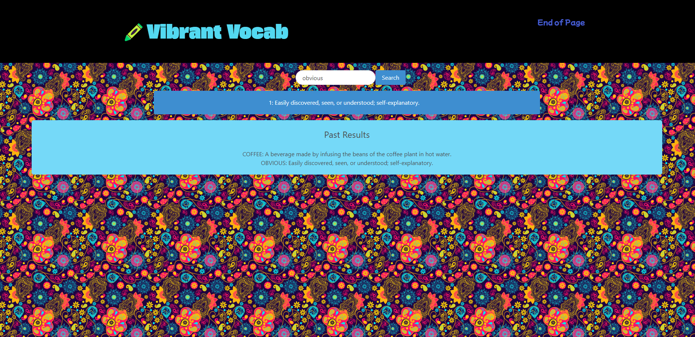

# Project 1: Colorful Dictionary

Other names
-Rainbow Words
-Techinicolor Termbook
-Vibrant Vocabulary
-ChromaLexicon
-Enchanting Glossary
-Vibrant Vocabulary

## Description

Our purpose of this website is to create a dictionary that saves past results. With every refresh, the background changes to create a fun and dynamic website as you continue to learn.

## Installation

1. On Github.com, navigate to the main page of the repository.
2. Above the list of files, click < > code.
3. Clone the repository.
4. Open terminal.
5. Change the current working directory to the location where you want the cloned directory.
6. Type git clone, and then paste the URL you copied earlier.
7. Press Enter to create your local clone.

## Usage

Provide instructions and examples for use. Include screenshots as needed.

To add a screenshot, create an `assets/images` folder in your repository and upload your screenshot to it. Then, using the relative file path, add it to your README using the following syntax:

## Credits

1. https://bulma.io/
2. https://www.wordsapi.com/
3. https://www.colourlovers.com/api

## Requirements

## Project Requirements
You and your group will use everything you’ve learned over the past six weeks to create a real-world front-end application that you’ll be able to showcase to potential employers. The user story and acceptance criteria will depend on the project that you create, but your project must fulfil the following requirements:

Use a CSS framework other than Bootstrap. 

Be deployed to GitHub Pages.

Be interactive (i.e: accept and respond to user input).

Use at least two server-side APIs.

Does not use alerts, confirms, or prompts (use modals).

Use client-side storage to store persistent data.

Be responsive.

Have a polished UI.

Have a clean repository that meets quality coding standards (file structure, naming conventions, follows best practices for class/id-naming conventions, indentation, quality comments, etc.).

Have a quality README (with unique name, description, technologies used, screenshot, and link to deployed application).

Finally, You must add your project to the portfolio that you created in Module 2.

## Presentation Requirements
Use this Project Presentation TemplateLinks to an external site. to address the following:

Elevator pitch: A one-minute description of your application.

Concept: What is your user story? What was your motivation for development?

Process: What were the technologies used? How were tasks and roles broken down and assigned? What challenges did you encounter? What were your successes?

Demo: Show your stuff!

Directions for future development.

Links to the deployed application and the GitHub repository.

## Grading Requirements
This project is graded based on the following criteria:

# NOTE

If a project submission is marked as “0”, it is considered incomplete and will not count towards your graduation requirements. Examples of incomplete submissions include the following:

A repository that has no code

A repository that includes a unique name but nothing else

A repository that includes only a README file but nothing else

A repository that only includes starter code

>Technical Acceptance Criteria: 25%
Satisfies the following code requirements:

Application uses at least two server-side APIs.

Application uses client-side storage to store persistent data.

Application doesn't use JS alerts, prompts, or confirms (uses modals instead).

Application uses a CSS framework other than Bootstrap.

Application is interactive (accepts and responds to user input).

>Concept 10%
Application should be a unique and novel idea.

Your group should clearly and concisely articulate your project idea.

>Deployment: 20%
Application deployed at live URL and loads with no errors.

Application GitHub URL submitted.

Portfolio at live URL submitted, featuring project.

>Repository Quality: 10%
Repository has a unique name.

Repository follows best practices for file structure and naming conventions.

Repository follows best practices for class/id-naming conventions, indentation, quality comments, etc.

Repository contains multiple descriptive commit messages.

Repository contains a quality README file with description, screenshot, and link to deployed application.

>Application Quality: 15%
Application user experience is intuitive and easy to navigate.

Application user interface style is clean and polished.

Application is responsive.

>Presentation 10%
Your group should present using Powerpoint or a similar presentation software.

Every group member should speak during the presentation.

Your presentation should follow the Project Presentation Template.

>Collaboration 10%
There are no major disparities in the number of GitHub contributions between group members.
How to Submit Your Interactive Front-End Project
Each member of your group is required to submit the following for review:

The URL of the deployed application.

The URL of the GitHub repository. Give the repository a unique name and include a README describing the project.

The URL of your portfolio, with your project added to it.
